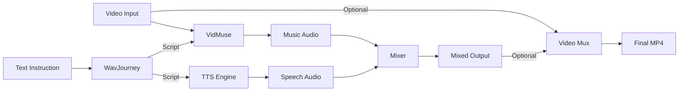

# Multimodal Audio Creator: A Unified Framework for Video-to-Audio Synthesis with Integrated VidMuse, TTS, and WavJourney Technologies

A unified toolkit for generating video-conditioned music, synthesizing speech, and producing professional audio mixes from the command line or web interface.

[](https://www.python.org/downloads/)
[](https://pytorch.org/)
[](#license--credits)

---

## Table of Contents

- [Overview](#overview)
- [Example Results](#example-results)
- [Features](#features)
- [System Requirements](#system-requirements)
- [Installation](#installation)
- [Quick Start](#quick-start)
- [Usage](#usage)
- [LoRA Training](#lora-training)
- [Architecture](#architecture)
- [Project Structure](#project-structure)
- [Troubleshooting](#troubleshooting)
- [References](#references)
- [License](#license)

---

## Overview

This project integrates state-of-the-art models for multimodal audio generation, including VidMuse (video-to-music), Coqui TTS (text-to-speech), and WavJourney (LLM-driven audio planning). It provides five operational modes through a single command-line interface and a Gradio-based web UI.

**Core capabilities:**
- Video-to-music generation using CLIP-conditioned MusicGen
- High-quality text-to-speech synthesis
- Intelligent audio mixing with sidechain ducking
- LLM-driven creative audio planning
- Custom LoRA training for domain-specific music styles

---

## Example Results

### Full Pipeline Demonstration

The AutoPipeline mode processes a video through the complete workflow: visual captioning, music generation, narration synthesis, and intelligent mixing.

https://github.com/user-attachments/assets/example.mp4

**Pipeline steps:**
1. Extract visual semantics from video frames using CLIP
2. Generate contextually appropriate background music
3. Synthesize narration from auto-generated captions
4. Apply sidechain ducking to lower music volume during speech
5. Normalize and mix to broadcast standards (LUFS)

---

### LoRA Fine-tuning Comparison

Fine-tuning VidMuse with LoRA adapters enables style transfer to specific musical genres or aesthetic preferences. The model was trained on 6 video-audio pairs from `data/train/` for 1 epoch, then evaluated on 5 test videos from `data/test/`.

Below is a comparison between base model output and LoRA-adapted generation on the same video input.

**Base Model Output:**

https://github.com/user-attachments/assets/base.mp4

**LoRA-Adapted Output (1 epoch, 6 training pairs):**

https://github.com/user-attachments/assets/lora.mp4

The LoRA adapter demonstrates improved alignment with the target musical domain, showing that even with limited training data and a single epoch, parameter-efficient fine-tuning can effectively adapt the model's output characteristics.

---

## Features

**Five Operational Modes:**
- `vidmuse` - Video-conditioned music generation with optional LoRA adaptation
- `tts` - Text-to-speech synthesis using Coqui or pyttsx3 backends
- `mix` - Professional audio mixing with ducking and loudness normalization
- `wavjourney` - LLM-driven audio script planning and orchestration
- `autopipeline` - Automated end-to-end workflow from video to mixed output

**Technical Highlights:**
- CLIP-based video encoding for semantic music conditioning
- CLAP-based audio-visual alignment scoring for candidate reranking
- LoRA parameter-efficient fine-tuning for custom style adaptation
- Sidechain ducking with configurable attack/release envelopes
- LUFS loudness normalization to broadcast standards
- OpenAI-compatible proxy support for restricted network environments

**Interfaces:**
- Command-line interface with comprehensive flag support
- Gradio web UI with real-time progress tracking and log panels
- FastAPI backend for programmatic integration

---

## System Requirements

**Minimum Configuration (CPU mode):**
- 4-core processor
- 16 GB RAM
- Python 3.10 or later
- 30 GB free disk space

**Recommended Configuration (GPU mode):**
- NVIDIA GPU with 8+ GB VRAM (CUDA 11.8 or later)
- 32 GB RAM
- 50+ GB SSD storage
- Linux or Windows 10/11

**Operating System:**
- Windows 10/11
- Ubuntu 20.04+ or other modern Linux distributions
- macOS (CPU mode only)

---

## Installation

### 1. Environment Setup

Create and activate a conda environment:

```bash
conda create -n audio-creator python=3.10
conda activate audio-creator
```

### 2. PyTorch Installation

Install PyTorch matching your CUDA version:

```bash
# For CUDA 11.8
pip install torch torchvision torchaudio --index-url https://download.pytorch.org/whl/cu118

# For CUDA 12.1
pip install torch torchvision torchaudio --index-url https://download.pytorch.org/whl/cu121

# For CPU only
pip install torch torchvision torchaudio
```

### 3. Project Dependencies

```bash
pip install -r requirements.txt
conda install -c conda-forge ffmpeg av
```

### 4. Model Downloads

Download VidMuse, CLIP, and CLAP checkpoints:

```bash
python scripts/download_models.py
```

This will populate `src/models/` with required weights (approximately 6-10 GB).

### 5. Environment Variables

Copy the environment template:

```bash
cp .env.example .env
```

Edit `.env` with your configuration:

```bash
OPENAI_API_KEY=sk-your-key-here
OPENAI_BASE_URL=https://your-proxy  # Optional: for proxy access
OPENAI_MODEL=gpt-4o
AUDIOCRAFT_CACHE_DIR=./src/models
TORCH_HOME=./src/models
```

---

## Quick Start

Generate music from a video in three steps:

```bash
# Activate environment
conda activate audio-creator

# Run VidMuse
python main.py --mode vidmuse \
  --video_path examples/2.mp4 \
  --output_path output/music.wav

# Launch web interface (alternative)
python app.py
```

The web UI will be available at `http://127.0.0.1:7860`.

---

## Usage

### Video to Music (VidMuse)

Generate music conditioned on video content using CLIP embeddings:

**Basic generation:**

```bash
python main.py --mode vidmuse \
  --video_path examples/2.mp4 \
  --output_path output/music.wav
```

**With LoRA adapter:**

```bash
python main.py --mode vidmuse \
  --video_path examples/2.mp4 \
  --output_path output/music.wav \
  --vidmuse-lora src/models/lora/vidmuse_lora.pt
```

**With candidate reranking:**

Generate multiple candidates and select the best via audio-visual alignment scoring:

```bash
python main.py --mode vidmuse \
  --video_path examples/2.mp4 \
  --output_path output/music.wav \
  --rerank 3 \
  --rerank-topk 1
```

**With video muxing:**

Merge generated audio back into the source video:

```bash
python main.py --mode vidmuse \
  --video_path examples/2.mp4 \
  --output_path output/music.wav \
  --merge-video \
  --merged-video-path output/final.mp4
```

### Text to Speech (TTS)

Synthesize natural-sounding speech from text:

```bash
python main.py --mode tts \
  --text "This is a demonstration of high-quality text-to-speech synthesis." \
  --output_path output/narration.wav
```

**Control speech parameters:**

```bash
python main.py --mode tts \
  --text "Your text here" \
  --output_path output/narration.wav \
  --tts-engine coqui \
  --speed 1.0 \
  --language en
```

### Audio Mixing

Mix music and speech tracks with intelligent ducking:

```bash
python main.py --mode mix \
  --music_path output/music.wav \
  --speech_path output/narration.wav \
  --output_path output/mixed.wav \
  --music_volume 0.6 \
  --speech_volume 1.0 \
  --ducking-db 8.0 \
  --target-lufs -16
```

**Ducking parameters:**
- `--ducking-db`: Amount to reduce music volume during speech (in dB)
- `--target-lufs`: Final loudness normalization target (broadcast standard: -16 LUFS)

### WavJourney (LLM-Driven Audio Creation)

Use an LLM to plan and execute complex audio generation workflows:

```bash
python main.py --mode wavjourney \
  --instruction "Create a 10-second cinematic intro with dramatic music and a professional voiceover" \
  --video_path examples/2.mp4 \
  --output_path output/wavjourney.wav \
  --llm-model gpt-4o
```

The LLM will generate a structured audio script, coordinate VidMuse and TTS modules, and produce the final mix.

### AutoPipeline (End-to-End Workflow)

Automated pipeline: video captioning → music generation → narration synthesis → mixing

**Basic usage:**

```bash
python main.py --mode autopipeline \
  --video_path examples/2.mp4 \
  --output_path output/auto.wav
```

**With all options:**

```bash
python main.py --mode autopipeline \
  --video_path examples/2.mp4 \
  --output_path output/auto.wav \
  --caption-backend openai \
  --caption-max-len 40 \
  --caption-frames 4 \
  --vidmuse-lora src/models/lora/vidmuse_lora.pt \
  --rerank 3 \
  --ducking-db 12 \
  --speed 0.95 \
  --merge-video \
  --merged-video-path output/auto.mp4
```

**Output artifacts:**
- `<stem>_caption.txt` - Generated caption
- `<stem>_music.wav` - Background music
- `<stem>_narr.wav` - Synthesized narration
- `<stem>.wav` - Final mixed audio
- `<stem>.mp4` - Video with audio (if `--merge-video` specified)

### Web Interface

Launch the Gradio-based web UI:

```bash
python app.py
```

Access at `http://127.0.0.1:7860`

**Available tabs:**
- **AutoPipeline**: Full workflow with progress tracking
- **VidMuse**: Video-to-music generation
- **TTS**: Text-to-speech synthesis

**Features:**
- Real-time progress bars
- Live status and log panels
- File upload/download interface
- Parameter configuration UI

**Custom port:**

```bash
python -m uvicorn app:app --host 0.0.0.0 --port 8000
```

---

## LoRA Training

Train custom LoRA adapters to fine-tune VidMuse for specific musical styles or domains.

### Training Data Preparation

The included dataset contains:
- Training set: 6 video-audio pairs in `data/train/`
- Test set: 5 video-audio pairs in `data/test/`

For custom datasets, organize files as:

```
data/train/
├── 1.mp4
├── 1.WAV
├── 2.mp4
├── 2.WAV
...
```

Requirements:
- Video: MP4 format, any resolution
- Audio: WAV format, matching video duration

### Generate Manifest

Create a CSV manifest listing all training pairs:

```bash
python scripts/gen_manifest.py \
  --video-dir data/train \
  --output data/train_manifest.csv
```

### Train LoRA Adapter

Train for 1 epoch (as used in the example results):

```bash
python scripts/train_lora_vidmuse.py \
  --manifest data/train_manifest.csv \
  --epochs 1 \
  --rank 4 \
  --alpha 16 \
  --lr 5e-4 \
  --batch-size 1 \
  --grad-accum 1 \
  --output src/models/lora/vidmuse_full.pt \
  --device cuda
```

**Hyperparameters:**
- `--rank`: LoRA rank (4-8 typical, higher = more parameters)
- `--alpha`: LoRA scaling factor (16-32 typical)
- `--lr`: Learning rate (5e-4 to 1e-3)
- `--epochs`: Training epochs (1-5 typical)

### Use Custom LoRA

```bash
python main.py --mode vidmuse \
  --video_path data/test/1.mp4 \
  --vidmuse-lora src/models/lora/vidmuse_full.pt \
  --output_path output/lora_music.wav
```

---

## Evaluation Framework

This project implements a comprehensive evaluation framework for video-to-music generation. The evaluation system supports multiple metrics and backends for assessing the quality and alignment of generated music.

### Evaluation Metrics

The framework computes four categories of metrics:

#### 1. Audio-Visual Alignment (sim)

Measures semantic coherence between video content and generated music using cosine similarity.

**Implementation:**
- Video embeddings: CLIP (ViT-B/32) encoding of uniformly sampled frames
- Audio embeddings: CLAP (Contrastive Language-Audio Pretraining) encoding
- Metric: Mean cosine similarity across all video-audio pairs

**Interpretation:** Higher values (closer to 1.0) indicate better alignment between visual semantics and musical characteristics.

#### 2. Retrieval Performance (retrieval)

Evaluates whether the model generates audio that can correctly match its source video in a retrieval task.

**Metrics:**
- **Recall@K**: Proportion of videos where correct audio ranks in top K (K=1, 5, 10)
- **Median Rank**: Median position of correct audio in ranked retrieval results
- **mAP**: Mean Average Precision (optional, requires scikit-learn)
- **nDCG**: Normalized Discounted Cumulative Gain (optional)

**Interpretation:** Higher recall and lower median rank indicate stronger video-audio correspondence.

#### 3. Distribution Distance (dist)

Measures how closely generated audio matches the distribution of reference music.

**Metrics:**
- **Frechet Distance**: FID-like metric computed on audio embeddings (CLAP/MuQ-MuLan/VGGish)
- **FAD**: Frechet Audio Distance using VGGish embeddings (requires `frechet_audio_distance` package)

**Interpretation:** Lower values indicate generated audio is more similar to reference distribution.

#### 4. Rhythm-Motion Correlation (rhythm)

Quantifies temporal alignment between video motion and audio rhythm patterns.

**Implementation:**
- Video motion: Optical flow magnitude (Farneback algorithm)
- Audio rhythm: Onset strength envelope (librosa)
- Metric: Pearson correlation between normalized motion and onset signals

**Interpretation:** Positive correlation indicates rhythm synchronization with visual motion.

### Audio Embedding Backends

The framework supports multiple audio embedding models:

| Backend | Model | Dimension | Use Case |
|---------|-------|-----------|----------|
| **clap** (default) | LAION-CLAP | 512 | General audio-visual alignment |
| **muq_mulan** | MuQ-MuLan-large | 128 | Music-specific embeddings (~700MB) |
| **vggish** | AudioSet VGGish | 128 | AudioSet-pretrained features |
| **vggsound** | VGGSound | 128 | Sound event embeddings |

### Usage Examples

#### Single Video Evaluation (Base vs LoRA)

Generate music with both base and LoRA models, then compare:

```bash
python scripts/offline_eval.py \
  --video data/test/1.mp4 \
  --lora-path src/models/lora/vidmuse_lora.pt \
  --output-dir output/eval \
  --metrics sim,retrieval,dist,rhythm \
  --audio-backend clap
```

Output includes AV alignment scores and comprehensive metrics for both variants.

#### Batch Evaluation from Manifest

Evaluate multiple video-audio pairs:

```bash
python scripts/offline_eval.py \
  --manifest data/test_manifest.csv \
  --metrics sim,retrieval,dist \
  --reference-audio-dir data/train \
  --audio-backend clap \
  --compute-map-ndcg
```

#### Using Alternative Audio Backends

MuQ-MuLan for music-specific evaluation:

```bash
python scripts/offline_eval.py \
  --manifest data/test_manifest.csv \
  --metrics sim,dist \
  --audio-backend muq_mulan \
  --audio-cache-dir ./src/models \
  --reference-audio-dir data/train
```

VGGish for AudioSet-style features:

```bash
python scripts/offline_eval.py \
  --manifest data/test_manifest.csv \
  --metrics sim,retrieval \
  --audio-backend vggish
```

#### Embedding Caching

For repeated evaluations, cache embeddings to save computation:

```bash
# First run: compute and save embeddings
python scripts/offline_eval.py \
  --manifest data/test_manifest.csv \
  --metrics sim,retrieval \
  --save-embeddings output/embeddings.npz

# Subsequent runs: load cached embeddings
python scripts/offline_eval.py \
  --manifest data/test_manifest.csv \
  --metrics sim,retrieval \
  --load-embeddings output/embeddings.npz
```

### Evaluation CLI Flags

**Input:**
- `--manifest PATH` - CSV with video_path,audio_path columns (batch mode)
- `--video PATH` - Single video for generation + evaluation (single mode)
- `--lora-path PATH` - LoRA checkpoint to compare against base

**Metrics:**
- `--metrics STR` - Comma-separated: `sim,retrieval,dist,rhythm`
- `--audio-backend STR` - Audio embedding model: `clap|muq_mulan|vggish|vggsound`
- `--reference-audio-dir PATH` - Reference music for distribution distance
- `--compute-map-ndcg` - Enable mAP/nDCG computation (requires sklearn)
- `--fad-backend STR` - FAD computation: `auto|frechet_audio_distance|none`

**Performance:**
- `--device STR` - Compute device: `auto|cuda|cpu`
- `--num-video-frames INT` - Frames to sample for video embeddings (default: 8)
- `--save-embeddings PATH` - Cache embeddings to .npz file
- `--load-embeddings PATH` - Load cached embeddings from .npz file

**Generation (single video mode):**
- `--output-dir PATH` - Output directory for generated audio
- `--duration FLOAT` - Music duration override
- `--rerank INT` - Number of candidates for reranking
- `--skip-base` - Skip base model, only evaluate LoRA
- `--no-single-metrics` - Skip embedding metrics, only compute AV alignment

### Implementation Details

**Audio-Visual Alignment Scoring:**

The alignment score is computed using CLIP for video and CLAP for audio:

1. **Video Processing**: Uniformly sample frames from video, encode with CLIP ViT-B/32
2. **Audio Processing**: Encode audio file with CLAP audio encoder
3. **Similarity**: Compute cosine similarity between normalized embeddings
4. **Output**: Scalar value in range [-1, 1]

**Frechet Distance Calculation:**

For distribution metrics, the framework computes Frechet distance between reference and generated audio embeddings:

```
FD = ||μ_ref - μ_gen||² + Tr(Σ_ref + Σ_gen - 2√(Σ_ref · Σ_gen))
```

Where μ and Σ are mean and covariance of embedding distributions.

**Rhythm-Motion Correlation:**

1. Extract optical flow from video frames (Farneback algorithm)
2. Compute onset strength envelope from audio (librosa)
3. Normalize both signals to zero mean, unit variance
4. Calculate Pearson correlation coefficient

---

## Architecture

### System Overview



### Pipeline Flow by Mode

**vidmuse:**
Video frames → CLIP encoding → MusicGen conditioning → Audio generation → Optional CLAP reranking → WAV output → Optional video muxing

**tts:**
Text input → TTS engine (Coqui/pyttsx3) → WAV output

**mix:**
Music + Speech → Loudness matching → Sidechain ducking → Fade in/out → LUFS normalization → WAV output

**wavjourney:**
Instruction (+video) → LLM planning → VidMuse + TTS execution → Mixer → WAV/MP4 output

**autopipeline:**
Video → OpenAI Vision captioning → VidMuse generation → TTS synthesis → Mixer → WAV/MP4 output

### Audio-Visual Alignment

The reranking mechanism uses CLAP (Contrastive Language-Audio Pretraining) to compute cosine similarity between video frame embeddings (CLIP visual encoder) and audio embeddings (CLAP audio encoder). Candidates with higher alignment scores are preferred, improving semantic coherence between visual content and generated music.

---

## Project Structure

```
.
├── main.py                       # CLI entry point
├── app.py                        # Gradio web interface
├── requirements.txt              # Python dependencies
├── .env                          # Environment template
│
├── scripts/
│   ├── download_models.py        # Model checkpoint downloader
│   ├── train_lora_vidmuse.py     # LoRA training script
│   ├── offline_eval.py           # Evaluation metrics
│   ├── gen_manifest.py           # Training manifest generator
│   └── test_openai_api.py        # API connectivity test
│
├── src/
│   ├── config.py                 # Global configuration
│   ├── modules/
│   │   ├── vidmuse/              # Video-to-music generation
│   │   │   ├── vidmuse_model.py  # VidMuse model wrapper
│   │   │   ├── video_processor.py # Video frame processing
│   │   │   ├── inference.py      # Generation pipeline
│   │   │   └── lora.py           # LoRA injection/extraction
│   │   ├── tts/
│   │   │   └── tts_engine.py     # Text-to-speech engines
│   │   ├── wavjourney/
│   │   │   └── planner.py        # LLM-driven planning
│   │   └── captioner/
│   │       └── captioner.py      # Video captioning
│   ├── utils/
│   │   ├── audio_mixer.py        # Mixing and ducking
│   │   └── av_alignment.py       # CLAP/CLIP scoring
│   ├── eval/
│   │   └── embedding_eval.py     # Evaluation backends
│   ├── models/                   # Model checkpoints
│   │   └── lora/                 # Custom LoRA adapters
│   │       └── vidmuse_full.pt   # Fine-tuned VidMuse LoRA weights (3.7MB)
│   └── output/                   # Generated outputs
│
├── data/
│   ├── train/                    # Training data (6 video-audio pairs)
│   └── test/                     # Test data (5 video-audio pairs)
│
├── examples/                     # Example videos
│   ├── 2.mp4, 4.mp4, 6.mp4      # Sample input videos
│   ├── example.mp4               # Full pipeline demo
│   ├── base.mp4                  # Base model output
│   └── lora.mp4                  # LoRA-adapted output
│
├── output/                       # Example generated outputs
│   ├── auto2_xtts_spk.mp4        # AutoPipeline result: examples/2.mp4 + music + narration
│   ├── auto4_xtts_spk.mp4        # AutoPipeline result: examples/4.mp4 + music + narration
│   └── auto6_xtts_spk.mp4        # AutoPipeline result: examples/6.mp4 + music + narration
│
└── tests/                        # Unit tests
```

---

## Troubleshooting

### CUDA Out of Memory

Reduce batch size and enable memory-efficient mode in `src/config.py`:

```python
VIDMUSE_CONFIG["batch_size"] = 1
ENABLE_MEMORY_EFFICIENT_MODE = True
```

Force CPU mode:

```bash
python main.py --mode vidmuse --device cpu --video_path examples/2.mp4
```

### OpenAI API Connection Issues

If direct access is blocked, configure a proxy:

```bash
export OPENAI_BASE_URL=https://your-proxy-domain.com
```

Do not append `/v1` to the base URL.

### FFmpeg Not Found

Ensure FFmpeg is installed:

```bash
conda install -c conda-forge ffmpeg av
```

Or install system-wide:

```bash
# Ubuntu/Debian
sudo apt install ffmpeg

# macOS
brew install ffmpeg
```

### Model Download Failures

Models are cached in `src/models/`. If downloads fail:

1. Check network connectivity
2. Verify Hugging Face access
3. Manually download from:
   - VidMuse: https://huggingface.co/Zeyue7/VidMuse
   - CLIP: https://huggingface.co/openai/clip-vit-base-patch32
   - CLAP: https://huggingface.co/laion/clap-htsat-fused

### Web UI Port Already in Use

Check and kill process on port 7860:

```bash
# Windows
netstat -ano | findstr :7860
taskkill /PID <pid> /F

# Linux/macOS
lsof -ti:7860 | xargs kill -9
```

Or use a different port:

```bash
python -m uvicorn app:app --port 8000
```

---

## References

**Models and Methods:**

- **VidMuse**: Zeyue Tian et al., "VidMuse: A Simple Video-to-Music Generation Framework with Long-Short-Term Modeling", HKUSTAudio, 2024. [GitHub](https://github.com/ZeyueT/VidMuse)

- **MusicGen**: Jade Copet et al., "Simple and Controllable Music Generation", Meta AI, 2023. [arXiv:2306.05284](https://arxiv.org/abs/2306.05284)

- **CLIP**: Alec Radford et al., "Learning Transferable Visual Models From Natural Language Supervision", OpenAI, 2021. [arXiv:2103.00020](https://arxiv.org/abs/2103.00020)

- **CLAP**: Yusong Wu et al., "Large-scale Contrastive Language-Audio Pretraining with Feature Fusion and Keyword-to-Caption Augmentation", 2023. [arXiv:2211.06687](https://arxiv.org/abs/2211.06687)

- **Coqui TTS**: Coqui.ai text-to-speech models and toolkit. [GitHub](https://github.com/coqui-ai/TTS)

- **WavJourney**: Xubo Liu et al., "WavJourney: Compositional Audio Creation with Large Language Models", 2023. [arXiv:2307.14335](https://arxiv.org/abs/2307.14335)

- **LoRA**: Edward Hu et al., "LoRA: Low-Rank Adaptation of Large Language Models", Microsoft, 2021. [arXiv:2106.09685](https://arxiv.org/abs/2106.09685)

---

## License

This project integrates multiple open-source components, each with its own license:

- **VidMuse**: Research code from HKUSTAudio (check upstream repository for terms)
- **MusicGen/AudioCraft**: MIT License (Meta AI)
- **CLIP**: MIT License (OpenAI)
- **CLAP**: Apache 2.0 License
- **Coqui TTS**: Mozilla Public License 2.0
- **WavJourney**: Research code (check upstream repository)

This integration project is provided for research and educational purposes. Commercial use should verify compliance with all upstream licenses.

---

## Acknowledgments

This project builds upon excellent work from:
- HKUSTAudio VidMuse team
- Meta AI AudioCraft team
- OpenAI CLIP team
- LAION CLAP team
- Coqui TTS contributors
